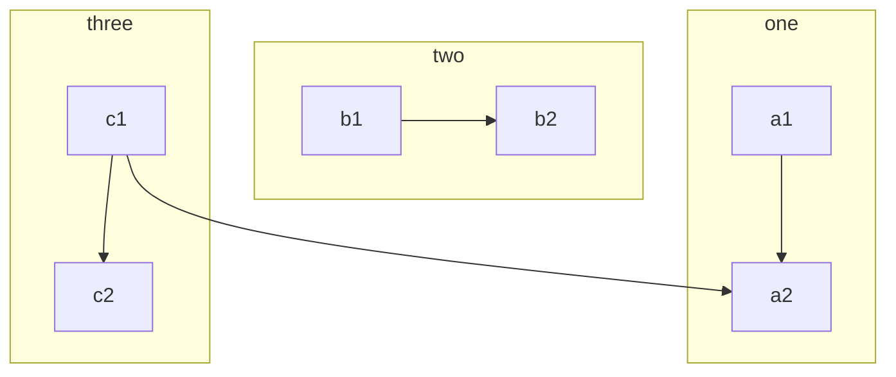

# Markdown Elements

Text can be `**bold**` **bold**, `_italic_` _italic_, or `~~strikethrough~~` ~~strikethrough~~. [Links](https://github.com) should be blue with no underlines (unless hovered over).

There should be whit## Table of Contents
[Headers](#headers)
[Emphasis](#emphasis)
[Lists](#lists)
[Links](#links)
[Images](#images)
[Tables](#tables)
[Blockquotes](#blockquotes)
[Inline HTML](#html)
[Horizontal Rule](#hr)
[Line Breaks](#lines)
[YouTube Videos](#videos)

<!-- markdownlint-disable -->
<a name="headers"/>
<!-- markdownlint-restore -->
## Headers

```markdown
# Heading 1
## Heading 2
### Heading 3
#### Heading 4
##### Heading 5
###### Heading 6
```

... becomes ...
<!-- markdownlint-disable -->
> # Heading 1
> ## Heading 2
> ### Heading 3
> #### Heading 4
> ##### Heading 5
> ###### Heading 6

<a name="emphasis"/>
<!-- markdownlint-restore -->
## Emphasis

```markdown
Emphasis, aka italics, with *asterisks* or _underscores_.
Strong emphasis, aka bold, with **asterisks** or __underscores__.
Combined emphasis with **asterisks and _underscores_**.
Strikethrough uses two tildes. ~~Scratch this.~~
```

... becomes ...

> Emphasis, aka italics, with *asterisks* or _underscores_.
> Strong emphasis, aka bold, with **asterisks** or __underscores__.
> Combined emphasis with **asterisks and _underscores_**.
> Strikethrough uses two tildes. ~~Scratch this.~~

<!-- markdownlint-disable -->
<a name="lists"/>
<!-- markdownlint-enable -->

## Callouts

### note

    
    ```note
    ### This is a note

    Markdown is supported, Text can be **bold**, _italic_, or ~~strikethrough~~. [Links](https://github.com) should be blue with no underlines

    `inline code`

    [`inline code inside link`](#)
    ```
    

```note
### This is a note

Markdown is supported, Text can be **bold**, _italic_, or ~~strikethrough~~. [Links](https://github.com) should be blue with no underlines

`inline code`

[`inline code inside link`](#)
```

### tip

    
    ```tip
    It’s bigger than a bread box.
    ```
    

```tip
It’s bigger than a bread box.
```

### warning

    
    ```warning
    Strong prose may provoke extreme mental exertion. Reader discretion is strongly advised.
    ```
    

```warning
Strong prose may provoke extreme mental exertion. Reader discretion is strongly advised.
```

### danger

    
    ```danger
    Mad scientist at work!
    ```
    

```danger
Mad scientist at work!
```

## List directory

If you want to list all `pages` in the current directory, add following code to your markdown file!





Then Generate a list like this:


If you want to list all `pages and sub directory` in the current directory, add following code to your markdown file!





Then Generate a list like this [table of contents]({{ site.baseurl }}/docs/)!

## Lists

(In this example, leading and trailing spaces are shown with with dots: ⋅)

```markdown
1. First ordered list item
2. Another item
⋅⋅* Unordered sub-list.
1. Actual numbers don't matter, just that it's a number
⋅⋅1. Ordered sub-list
4. And another item.
<!-- markdownlint-disable -->
⋅⋅⋅You can have properly indented paragraphs within list items. Notice the blank line above, and the leading spaces (at least one, but we'll use three here to also align the raw Markdown).

⋅⋅⋅To have a line break without a paragraph, you will need to use two trailing spaces.⋅⋅
⋅⋅⋅Note that this line is separate, but within the same paragraph.⋅⋅
⋅⋅⋅(This is contrary to the typical GFM line break behaviour, where trailing spaces are not required.)

* Unordered list can use asterisks
- Or minuses
+ Or pluses
```

... becomes ...

> 1. First ordered list item
> 2. Another item
>   * Unordered sub-list.
> 1. Actual numbers don't matter, just that it's a number
>   1. Ordered sub-list
> 4. And another item.
>    You can have properly indented paragraphs within list items. Notice the blank line above, and the leading spaces (at least one, but we'll use three here to also align the raw Markdown).
>    To have a line break without a paragraph, you will need to use two trailing spaces.
>    Note that this line is separate, but within the same paragraph.
>    (This is contrary to the typical GFM line break behaviour, where trailing spaces are not required.)
> * Unordered list can use asterisks
> - Or minuses
> + Or pluses

<a name="links"/>
<!-- markdownlint-enable -->
## Links

There are two ways to create links.

```markdown
[I'm an inline-style link](https://www.google.com)
[I'm an inline-style link with title](https://www.google.com "Google's Homepage")
[I'm a relative reference to a repository file](../blob/master/LICENSE)
[You can use numbers for reference-style link definitions][1]

Or leave it empty and use the [link text itself].

[1]: http://slashdot.org
[link text itself]: http://www.reddit.com
```

... becomes ...

> [I'm an inline-style link](https://www.google.com)
> [I'm an inline-style link with title](https://www.google.com "Google's Homepage")
> [I'm a relative reference to a repository file](../blob/master/LICENSE)
> [You can use numbers for reference-style link definitions][1]
<!-- markdownlint-disable -->

> Or leave it empty and use the [link text itself].

> [1]: http://slashdot.org
> [link text itself]: http://www.reddit.com
<a name="images"/>


## Images

```markdown
Inline-style:


Reference-style:
![alt text][logo]

[logo]: https://github.com/psmware-ltd/the-docs/blob/develop/img/sap.png =48x48 "Logo Title Text 2"
```

{{ site.pages.baseurl }}

... becomes ...

> Here's our logo (hover to see the title text):
> Inline-style:
> 
> Reference-style:
> ![alt text][logo]
>
> [logo]:  {{ site.baseurl }}/img/sap.png =48x48 "Logo Title Text 2"

<a name="tables"/>

## Tables

Tables aren't part of the core Markdown spec, but they are part of GFM and *Markdown Here* supports them. They are an easy way of adding tables to your email -- a task that would otherwise require copy-pasting from another application.

```markdown
Colons can be used to align columns.

| Tables        | Are           | Cool  |
| ------------- |:-------------:| -----:|
| col 3 is      | right-aligned | $1600 |
| col 2 is      | centered      |   $12 |
| zebra stripes | are neat      |    $1 |

There must be at least 3 dashes separating each header cell.
The outer pipes (|) are optional, and you don't need to make the
raw Markdown line up prettily. You can also use inline Markdown.

Markdown | Less | Pretty
--- | --- | ---
*Still* | `renders` | **nicely**
1 | 2 | 3
```
... becomes ...

> Colons can be used to align columns.
>
> | Tables        | Are           | Cool |
> | ------------- |:-------------:| -----:|
> | col 3 is      | right-aligned | $1600 |
> | col 2 is      | centered      |   $12 |
> | zebra stripes | are neat      |    $1 |
>
> There must be at least 3 dashes separating each header cell. The outer pipes ( \| ) are optional, and you don't need to make the raw Markdown line up prettily. You can also use inline Markdown.
>
> Markdown | Less | Pretty
> --- | --- | ---
> *Still* | `renders` | **nicely**
> 1 | 2 | 3

<a name="blockquotes"/>

## Blockquotes

```m
> Blockquotes are very handy in email to emulate reply text.
> This line is part of the same quote.

Quote break.

> This is a very long line that will still be quoted properly when it wraps. Oh boy let's keep writing to make sure this is long enough to actually wrap for everyone. Oh, you can *put* **Markdown** into a blockquote.
```

becomes:

> Blockquotes are very handy in email to emulate reply text.
> This line is part of the same quote.

Quote break.

> This is a very long line that will still be quoted properly when it wraps. Oh boy let's keep writing to make sure this is long enough to actually wrap for everyone. Oh, you can *put* **Markdown** into a blockquote.

<a name="html"/>

## Inline HTML

You can also use raw HTML in your Markdown, and it'll mostly work pretty well.

```no-highlight
<dl>
  <dt>Definition list</dt>
  <dd>Is something people use sometimes.</dd>

  <dt>Markdown in HTML</dt>
  <dd>Does *not* work **very** well. Use HTML <em>tags</em>.</dd>
</dl>
```

<dl>
  <dt>Definition list</dt>
  <dd>Is something people use sometimes.</dd>

  <dt>Markdown in HTML</dt>
  <dd>Does *not* work **very** well. Use HTML <em>tags</em>.</dd>
</dl>

<a name="hr"/>

## Horizontal Rule

```
Three or more...

---

Hyphens

***

Asterisks

___

Underscores
```

Three or more...

---

Hyphens

***

Asterisks

___

Underscores

<a name="lines"/>

## Line Breaks

My basic recommendation for learning how line breaks work is to experiment and discover -- hit &lt;Enter&gt; once (i.e., insert one newline), then hit it twice (i.e., insert two newlines), see what happens. You'll soon learn to get what you want. "Markdown Toggle" is your friend.

Here are some things to try out:

```
Here's a line for us to start with.

This line is separated from the one above by two newlines, so it will be a *separate paragraph*.

This line is also a separate paragraph, but...
This line is only separated by a single newline, so it's a separate line in the *same paragraph*.
```

Here's a line for us to start with.

This line is separated from the one above by two newlines, so it will be a *separate paragraph*.

This line is also begins a separate paragraph, but...
This line is only separated by a single newline, so it's a separate line in the *same paragraph*.

(Technical note: *Markdown Here* uses GFM line breaks, so there's no need to use MD's two-space line breaks.)

<a name="videos"/>

## Mermaid

    ```mermaid
    graph TB
        c1-->a2
        subgraph one
        a1-->a2
        end
        subgraph two
        b1-->b2
        end
        subgraph three
        c1-->c2
        end
    ```



## Optional settings

Theme initialize mermaid with default configuration (`{}`), You can custom config like this:

```yml
mermaid:
  initialize:
    startOnLoad: true
    logLevel: fatal
    flowchart:
      diagramPadding: 8
      htmlLabels: true
      curve: linear
    gantt:
      titleTopMargin: 25
    .
    .
    .
```

```tip
The theme chooses the stable version of mermaid, if you want to use the custom mermaid, add following configuration
```

```yml
mermaid:
  custom: https://cdn.jsdelivr.net/npm/mermaid/dist/mermaid.min.js
```

Mermaid documentation, see: [https://mermaid-js.github.io/mermaid/](https://mermaid-js.github.io/mermaid/)